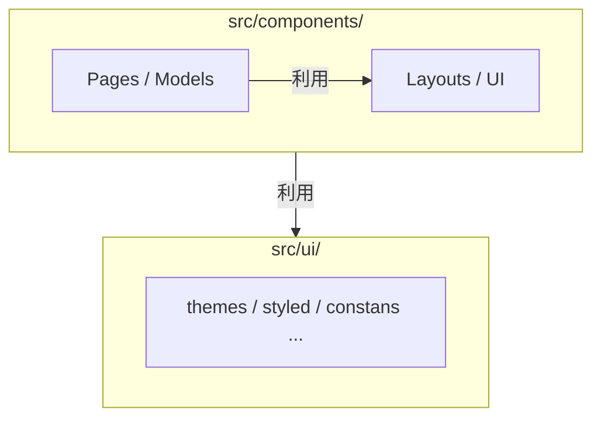

## ディレクトリの分割戦略
### 概要
本ディレクトリは役割を明確にした配置（責務分離）を行います。
これにより「迷わない分類」が可能になり、新しいコンポーネントを作成する際、配置場所で迷う時間を最小化し、メンバー間で判断が分かれないことを目指します。

本ディレクトリでは以下の２点を重視します。
1. 運用中の移動最小化: 一度配置したコンポーネントは、基本的に移動が不要
2. 予測可能な構造: ディレクトリ階層が深くならず、探索しやすい

この構造を実現するため、以下の２層構造を採用します。
1. コンポーネント層（src/components/）:役割別に5つのディレクトリに分類
2. UIインフラ層(src/ui/):コンポーネントが利用する共通基盤

コンポーネント層とUIインフラ層の関係は以下の通りです



### コンポーネント層の設計
コンポーネントを５つの役割に分類し、それぞれの責務と依存関係を定義します
#### ディレクトリ構成
```
src/components/
├── UI/
├── Models/
├── Pages/
├── Layouts/
└── Functional/
```
※ Next.jsのルーティング用ディレクトリ（src/pages）と区別するため、頭を大文字とする

#### 責務ごとの分類
各ディレクトリの役割は以下のように定義します
| 名前         | 役割                | 格納するコンポーネント例               |
| ---------- | ----------------- | -------------------------- |
| UI         | 純粋なUI要素           | Button, Collapse, Image... |
| Models     | ドメインロジックがある       | ProductList, BrandList...  |
| Pages      | ページ専用             | HomePage, SearchPage...    |
| Layouts    | アプリに関わるレイアウト      | Header, Footer...          |
| Functional | UIを伴わないアプリケーション機能 | Analytics, GlobalStore...  |

#### コンポーネント作成時の判断フロー
コンポーネントを作成する際は、以下の判断基準に従います

1. 特定のページでのみ使用するか？
* **YES →** `src/components/Pages/` に配置
* **判断基準：** 他のページでは再利用されない固有の実装
* **例：** `HomePage`, `SearchPage`

2. アプリ全体のレイアウト構造に関わるか？
* **YES →** `src/components/Layouts/` に配置
* **判断基準：** アプリ全体の構造・骨格を担当
* **例：** `Header`, `Footer`

3. 特定のドメインロジックを含み複数ページで使用するか？
* **YES →** `src/components/Models/` に配置
* **判断基準：** 特定のドメインに関連する機能を持つコンポーネント
* **例：** `ProductList`, `BrandList`

4. UIのみの汎用的なコンポーネントか？
* **YES →** `src/components/UI/` に配置
* **判断基準：** ビジネスロジックを含まない純粋なUI要素
* **例：** `Button`, `Collapse`, `Image`
> **重要：**
> ドメイン固有の名前を持つコンポーネントでも、データを表示するだけならUIに配置
> Modelsとの違いは **データ取得やビジネスルールを含むかどうか**。

5. UIを伴わないアプリケーション機能か？
* **YES →** `src/components/Functional/` に配置
* **判断基準：** 直接ユーザーに表示されないアプリケーション機能
* **例：** `Analytics`, `GlobalStore`

#### 実装例
##### UIコンポーネント
propsで受け取ったデータを表示するだけのシンプルな実装
```tsx
// UI/ProductCard - UI コンポーネント
export const ProductCard = ({ name, price, image }: Props) => (
  <Card>
    <Image src={image} />
    <Title>{name}</Title>
    <Price>{price}</Price>
  </Card>
)
```

##### Models コンポーネント
データを取得し、UIコンポーネントを組み合わせて表示する
```tsx
// Models/ProductList - ドメインロジック + UI を利用
export const ProductList = (props) => {
  const { products } = useProductData(props);

  return (
    <Grid>
      {products?.map((product) => (
        <ProductCard key={product.id} {...product} />
      ))}
    </Grid>
  );
};
```
ProductCard（UI）は純粋な表示、ProductList（Models）はデータ取得とUIの組み合わせという責務の違いが分かる

####テストファイルの配置
コンポーネントの分類と同様に、テストファイルの配置もルールが必要です
テストやStorybookのファイルは、対象のコンポーネントファイルと同じディレクトリに配置することで、関連するファイルを一箇所にまとめて管理します
```
components/UI/Button/
├── Button.tsx
├── Button.test.tsx
├── Button.stories.tsx
└── Button.module.css
```
この配置により、実装とテストの対応関係が分かりやすくなり、ファイル間の移動もスムーズになります

#### 依存関係のルール
コンポーネント間の依存関係は「自分の横か下にある分類のコンポーネントのみ参照してよい」という原則に従います

依存の基本原則：上位から下位への一方向のみ許可
- Pages（src/components/Pages）: Models、UI、Functionalを参照可能
- Models・Layouts: UIとFunctionalを参照可能
- UI: Functionalのみ参照可能
- Functional: 外部依存なし（最下位）
各ディレクトリは、同じディレクトリ内のコンポーネント同士も参照可能です（Pagesを除く）
> **注記：**
> ここでの「Pages」は src/components/Pages（ページ専用コンポーネント）を指します
> Next.jsのルーティング用ディレクトリである src/pages は、アプリケーションのエントリーポイントとして特別な役割を持つため、Layoutsを含むすべてのコンポーネントを参照可能です

この依存関係により、循環参照を防ぎ、変更の影響範囲を予測しやすくします

#### 依存関係のチェック
設計したディレクトリ構成のルールが守られるよう、ESLintを導入します


