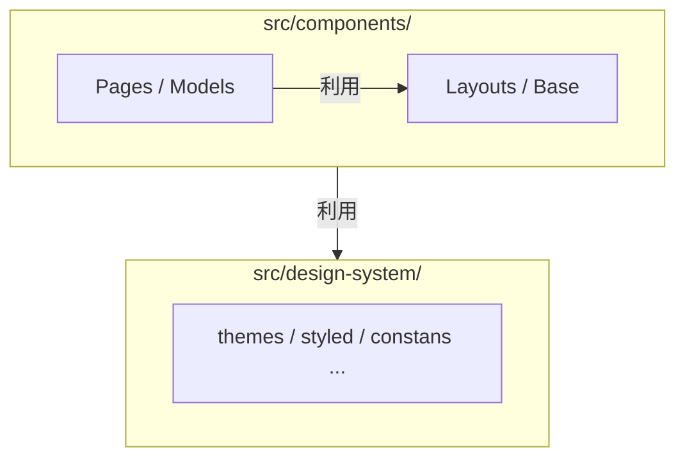
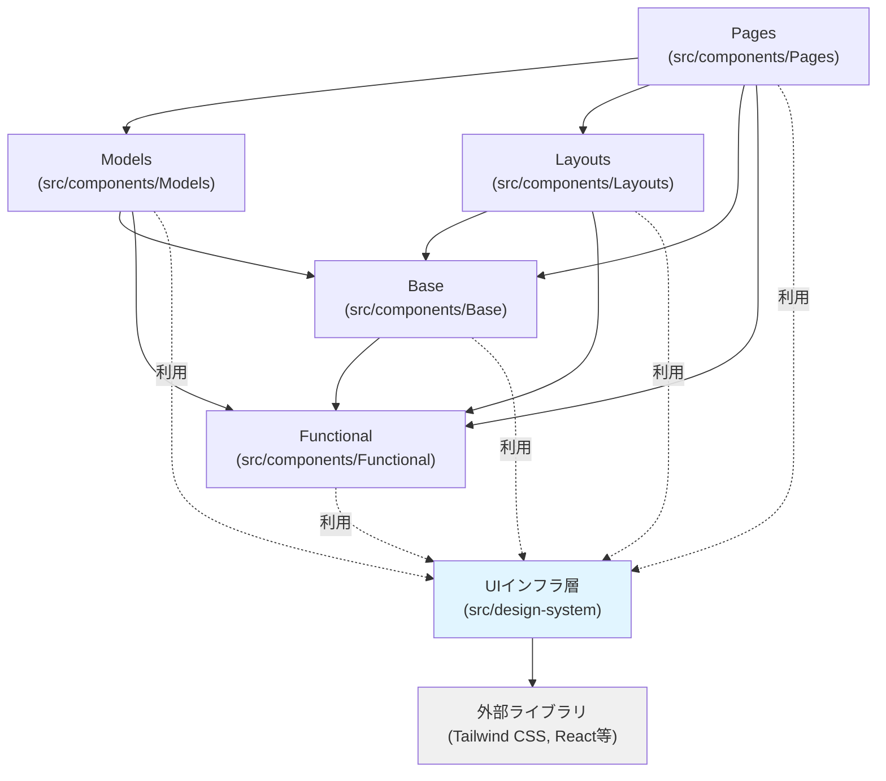

## ディレクトリの分割戦略
### 概要
本ディレクトリは役割を明確にした配置（責務分離）を行います。
これにより「迷わない分類」が可能になり、新しいコンポーネントを作成する際、配置場所で迷う時間を最小化し、メンバー間で判断が分かれないことを目指します。

本ディレクトリでは以下の２点を重視します。
1. 運用中の移動最小化: 一度配置したコンポーネントは、基本的に移動が不要
2. 予測可能な構造: ディレクトリ階層が深くならず、探索しやすい

この構造を実現するため、以下の２層構造を採用します。
1. コンポーネント層（src/components/）:役割別に5つのディレクトリに分類
2. UIインフラ層(src/design-system/):コンポーネントが利用する共通基盤

コンポーネント層とUIインフラ層の関係は以下の通りです



### コンポーネント層の設計
コンポーネントを５つの役割に分類し、それぞれの責務と依存関係を定義します
#### ディレクトリ構成
```
src/components/
├── Base/
├── Models/
├── Pages/
├── Layouts/
└── Functional/
```
※ Next.jsのルーティング用ディレクトリ（src/pages）と区別するため、頭を大文字とする

#### 責務ごとの分類
各ディレクトリの役割は以下のように定義します
| 名前         | 役割                | 格納するコンポーネント例               |
| ---------- | ----------------- | -------------------------- |
| Base       | 純粋なUI要素           | Button, Collapse, Image... |
| Models     | ドメインロジックがある       | ProductList, BrandList...  |
| Pages      | ページ専用             | HomePage, SearchPage...    |
| Layouts    | アプリに関わるレイアウト      | Header, Footer...          |
| Functional | UIを伴わないアプリケーション機能 | Analytics, GlobalStore...  |

#### コンポーネント作成時の判断フロー
コンポーネントを作成する際は、以下の判断基準に従います

1. 特定のページでのみ使用するか？
* **YES →** `src/components/Pages/` に配置
* **判断基準：** 他のページでは再利用されない固有の実装
* **例：** `HomePage`, `SearchPage`

2. アプリ全体のレイアウト構造に関わるか？
* **YES →** `src/components/Layouts/` に配置
* **判断基準：** アプリ全体の構造・骨格を担当
* **例：** `Header`, `Footer`

3. 特定のドメインロジックを含み複数ページで使用するか？
* **YES →** `src/components/Models/` に配置
* **判断基準：** 特定のドメインに関連する機能を持つコンポーネント
* **例：** `ProductList`, `BrandList`

4. UIのみの汎用的なコンポーネントか？
* **YES →** `src/components/Base/` に配置
* **判断基準：** ビジネスロジックを含まない純粋なUI要素
* **例：** `Button`, `Collapse`, `Image`
> **重要：**
> ドメイン固有の名前を持つコンポーネントでも、データを表示するだけならBaseに配置
> Modelsとの違いは **データ取得やビジネスルールを含むかどうか**。

5. UIを伴わないアプリケーション機能か？
* **YES →** `src/components/Functional/` に配置
* **判断基準：** 直接ユーザーに表示されないアプリケーション機能
* **例：** `Analytics`, `GlobalStore`

#### 実装例
##### Baseコンポーネント
propsで受け取ったデータを表示するだけのシンプルな実装
```tsx
// Base/ProductCard - Base コンポーネント
export const ProductCard = ({ name, price, image }: Props) => (
  <Card>
    <Image src={image} />
    <Title>{name}</Title>
    <Price>{price}</Price>
  </Card>
)
```

##### Models コンポーネント
データを取得し、Baseコンポーネントを組み合わせて表示する
```tsx
// Models/ProductList - ドメインロジック + Base を利用
export const ProductList = (props) => {
  const { products } = useProductData(props);

  return (
    <Grid>
      {products?.map((product) => (
        <ProductCard key={product.id} {...product} />
      ))}
    </Grid>
  );
};
```
ProductCard（Base）は純粋な表示、ProductList（Models）はデータ取得とBaseの組み合わせという責務の違いが分かる

####テストファイルの配置
コンポーネントの分類と同様に、テストファイルの配置もルールが必要です
テストやStorybookのファイルは、対象のコンポーネントファイルと同じディレクトリに配置することで、関連するファイルを一箇所にまとめて管理します
```
components/Base/Button/
├── Button.tsx
├── Button.test.tsx
├── Button.stories.tsx
└── Button.module.css
```
この配置により、実装とテストの対応関係が分かりやすくなり、ファイル間の移動もスムーズになります

#### 依存関係のルール
コンポーネント間の依存関係は「自分の横か下にある分類のコンポーネントのみ参照してよい」という原則に従います

依存の基本原則：上位から下位への一方向のみ許可
- Pages（src/components/Pages）: Models、Base、Functionalを参照可能
- Models・Layouts: BaseとFunctionalを参照可能
- Base: Functionalのみ参照可能
- Functional: 外部依存なし（最下位）
各ディレクトリは、同じディレクトリ内のコンポーネント同士も参照可能です（Pagesを除く）
> **注記：**
> ここでの「Pages」は src/components/Pages（ページ専用コンポーネント）を指します
> Next.jsのルーティング用ディレクトリである src/pages は、アプリケーションのエントリーポイントとして特別な役割を持つため、Layoutsを含むすべてのコンポーネントを参照可能です

この依存関係により、循環参照を防ぎ、変更の影響範囲を予測しやすくします

#### 依存関係のチェック
設計したディレクトリ構成のルールが守られるよう、ESLintを導入します

### UIインフラ層の設計
UIインフラ層（`src/design-system/`）は、コンポーネント層が利用する共通基盤として、デザイントークン、ユーティリティ関数、スタイリングソリューションを提供します。この層を適切に設計することで、一貫性のあるUI実装と効率的な開発が可能になります。

#### スタイリングソリューションの選定
##### Tailwind CSSの採用
本テンプレートでは、スタイリングソリューションとして **Tailwind CSS** を採用します。

**採用理由:**
1. **学習コストの低さ**: ユーティリティファーストのアプローチにより、CSS in JSやCSS Modulesと比較して学習コストが低い
2. **パフォーマンス**: ビルド時に未使用のスタイルを削除（PurgeCSS）することで、本番環境でのCSSファイルサイズを最小化
3. **汎用性**: フレームワークに依存しないため、React以外のプロジェクトにも展開可能
4. **開発効率**: クラス名を組み合わせるだけで迅速にスタイリングが可能
5. **一貫性**: デザイントークンベースのシステムにより、一貫したデザインを維持しやすい

**他のソリューションとの比較:**

| ソリューション | メリット | デメリット | 検討すべき場合 |
|------------|---------|-----------|--------------|
| Tailwind CSS | 学習コスト低、パフォーマンス高、汎用性高 | HTML が冗長になりがち | 汎用的なテンプレートとして最適 |
| Emotion/styled-components | 動的スタイリングが容易、TypeScript との親和性高 | ランタイムコスト、学習コスト高 | 高度な動的スタイリングが必要な場合 |
| CSS Modules | スコープの隔離が容易 | グローバルなデザインシステム構築が困難 | レガシーコードベースとの統合時 |

#### 命名に関する重要な注意
##### `src/components/Base/` と `src/design-system/` の区別
本テンプレートでは、以下の2つの似た名前のディレクトリが存在します：

- **`src/components/Base/`**: 純粋なUIコンポーネント（Button, Imageなど）
- **`src/design-system/`**: UIインフラ層（デザイントークン、ユーティリティなど）

**混同を避けるための判断基準:**
```text
ファイルを配置する際の質問:
├─ これはReactコンポーネント（.tsxファイル）か？
│  └─ YES → src/components/Base/
│
└─ これはデザイントークン、定数、ユーティリティか？
   └─ YES → src/design-system/
```

**具体例:**
```tsx
// ❌ 間違い: UIコンポーネントをsrc/design-system/に配置
// src/design-system/Button.tsx
export const Button = ({ children }: Props) => <button>{children}</button>

// ✅ 正解: UIコンポーネントはsrc/components/Base/に配置
// src/components/Base/Button/Button.tsx
export const Button = ({ children }: Props) => <button>{children}</button>

// ✅ 正解: デザイントークンはsrc/design-system/に配置
// src/design-system/themes/colors.ts
export const colors = {
  primary: '#3B82F6',
  secondary: '#10B981',
} as const;
```

**命名の決定:**
混同リスクを低減するため、以下の命名を採用しています：
- `src/design-system/`: UIインフラ層（デザイントークン、ユーティリティなど）
- `src/components/Base/`: 純粋なUIコンポーネント（Button、Imageなど）

この命名により、役割の区別が明確になり、ファイルの配置場所で迷うことを最小化します。

#### ディレクトリ構成
```text
src/design-system/
├── themes/           # デザイントークン（色、サイズ、タイポグラフィ等）
│   ├── colors.ts     # カラーパレット定義
│   ├── spacing.ts    # スペーシングシステム
│   ├── typography.ts # タイポグラフィ設定
│   └── index.ts      # テーマの統合エクスポート
├── utils/            # UIユーティリティ関数
│   ├── cn.ts         # クラス名結合ユーティリティ
│   └── responsive.ts # レスポンシブヘルパー
└── constants/        # UI共通定数
    ├── breakpoints.ts # レスポンシブブレークポイント
    └── zIndex.ts     # z-index管理
```

#### デザイントークンの管理方針
##### TypeScriptによる型安全なデザイントークン
デザイントークンは、TypeScriptの`as const`を使用して定義し、型安全性を確保します。

**実装例:**
```typescript
// src/design-system/themes/colors.ts
export const colors = {
  // Primary colors
  primary: {
    50: '#EFF6FF',
    100: '#DBEAFE',
    500: '#3B82F6',
    900: '#1E3A8A',
  },
  // Semantic colors
  success: '#10B981',
  error: '#EF4444',
  warning: '#F59E0B',
} as const;

// 型推論により、存在しない色を参照するとコンパイルエラーになる
type ColorKeys = keyof typeof colors; // 'primary' | 'success' | 'error' | 'warning'
type PrimaryShades = keyof typeof colors.primary; // '50' | '100' | '500' | '900'
```

```typescript
// src/design-system/themes/spacing.ts
export const spacing = {
  xs: '0.25rem',  // 4px
  sm: '0.5rem',   // 8px
  md: '1rem',     // 16px
  lg: '1.5rem',   // 24px
  xl: '2rem',     // 32px
} as const;

export type Spacing = keyof typeof spacing;
```

##### Tailwind CSS設定との統合（Single Source of Truth）
デザイントークンを **TypeScript で定義** し、それをTailwind CSS設定にインポートすることで、単一の信頼できる情報源（Single Source of Truth）を確立します。

**推奨アプローチ:**
```javascript
// tailwind.config.js
import { colors } from './src/design-system/themes/colors';
import { spacing } from './src/design-system/themes/spacing';

export default {
  theme: {
    extend: {
      colors: colors,
      spacing: spacing,
    },
  },
};
```

**このアプローチのメリット:**
1. **型安全性**: TypeScript のコンパイル時にトークンの存在を検証可能
2. **一元管理**: デザイントークンの変更が TypeScript と Tailwind CSS の両方に自動反映
3. **IntelliSense**: エディタの補完機能により、存在しないトークンを参照するリスクを低減

**逆方向（Tailwind → TypeScript）は推奨しない理由:**
```typescript
// ❌ 非推奨: Tailwind設定から型を生成
// - ビルドプロセスが複雑化
// - 型生成のタイミング問題（開発中にすぐ反映されない）
// - TypeScriptファーストの開発体験を損なう
```

#### コンポーネント層との連携
##### Tailwind CSSクラスの使用
コンポーネントでは、Tailwind CSSのユーティリティクラスを直接使用します。

```tsx
// src/components/Base/Button/Button.tsx
export const Button = ({ variant = 'primary', children }: Props) => {
  // クラス名の動的な結合にはcnユーティリティを使用
  const className = cn(
    'px-4 py-2 rounded font-medium transition-colors',
    {
      'bg-blue-500 text-white hover:bg-blue-600': variant === 'primary',
      'bg-gray-200 text-gray-800 hover:bg-gray-300': variant === 'secondary',
    }
  );
  
  return <button className={className}>{children}</button>;
};
```

##### デザイントークンの活用
TypeScriptで定義したデザイントークンは、動的スタイリングが必要な場合に使用します。

```tsx
// src/components/Base/Card/Card.tsx
import { colors } from '@/ui/themes/colors';
import { spacing } from '@/ui/themes/spacing';

export const Card = ({ accentColor, children }: Props) => {
  return (
    <div 
      className="rounded-lg shadow-md p-4"
      style={{
        // 動的な色指定が必要な場合
        borderLeft: `4px solid ${colors.primary[500]}`,
        padding: spacing.md,
      }}
    >
      {children}
    </div>
  );
};
```

**使い分けの原則:**
- **静的なスタイル**: Tailwind CSSのクラス名を使用（推奨）
- **動的なスタイル**: TypeScriptのデザイントークンをインラインスタイルで使用

##### クラス名結合ユーティリティ
複数のクラス名を条件付きで結合する場合、`cn`ユーティリティを使用します。

```typescript
// src/design-system/utils/cn.ts
import { type ClassValue, clsx } from 'clsx';
import { twMerge } from 'tailwind-merge';

/**
 * Tailwind CSSのクラス名を結合し、競合を解決するユーティリティ
 */
export function cn(...inputs: ClassValue[]) {
  return twMerge(clsx(inputs));
}
```

```tsx
// 使用例
import { cn } from '@/ui/utils/cn';

const buttonClass = cn(
  'px-4 py-2 rounded',
  isActive && 'bg-blue-500',
  isDisabled && 'opacity-50 cursor-not-allowed'
);
```

#### UIに関連するフックの配置について
UI レンダリングに直接関わるフック（`useMediaQuery`, `useTheme`等）の配置について、以下の判断基準を設けます。

**配置の判断基準:**

| フックの種類 | 配置場所 | 判断基準 | 例 |
|-----------|---------|---------|-----|
| UIレンダリング直結 | `src/design-system/hooks/` | DOMやレスポンシブ、テーマに関連する汎用的なフック | `useMediaQuery`, `useTheme`, `useBreakpoint` |
| ビジネスロジック | `src/components/Functional/hooks/` | ドメイン固有のデータ取得やビジネスルール | `useProductData`, `useAuth` |

**実装例:**
```typescript
// src/design-system/hooks/useMediaQuery.ts
export function useMediaQuery(query: string): boolean {
  const [matches, setMatches] = useState(false);

  useEffect(() => {
    const media = window.matchMedia(query);
    setMatches(media.matches);
    
    const listener = () => setMatches(media.matches);
    media.addEventListener('change', listener);
    return () => media.removeEventListener('change', listener);
  }, [query]);

  return matches;
}

// src/components/Base/ResponsiveImage/ResponsiveImage.tsx
import { useMediaQuery } from '@/ui/hooks/useMediaQuery';

export const ResponsiveImage = ({ src, srcMobile }: Props) => {
  const isMobile = useMediaQuery('(max-width: 768px)');
  return ;
};
```

**重要な注意点:**
`src/components/Functional/` との重複を避けるため、**UIレンダリングに直接関係しない汎用的なフック** は明確に区別する必要があります。判断が難しい場合は、以下の質問で確認します：

> **Q: このフックはビジネスロジックを含むか？**
> - **YES** → `src/components/Functional/hooks/`
> - **NO** → `src/design-system/hooks/`

#### 依存関係のルール
UIインフラ層は、アーキテクチャの最下位層として位置づけられます。



**依存関係のルール:**
1. **すべてのコンポーネント層** は UIインフラ層（`src/design-system/`）を参照可能
2. **UIインフラ層** は外部ライブラリ（Tailwind CSS、Reactなど）のみに依存
3. **UIインフラ層** は `src/components/` 内のどのディレクトリも参照してはならない

**具体的な依存関係:**

| 層 | 依存可能な層 |
|----|-----------|
| Pages | Models, Layouts, Base, Functional, **UIインフラ層** |
| Models | Base, Functional, **UIインフラ層** |
| Layouts | Base, Functional, **UIインフラ層** |
| Base | Functional, **UIインフラ層** |
| Functional | **UIインフラ層** |
| **UIインフラ層** | 外部ライブラリのみ |

この依存関係により、UIインフラ層の変更はすべてのコンポーネント層に影響を与える可能性がありますが、コンポーネント層の変更はUIインフラ層に影響を与えません。これにより、デザインシステムの一貫性を保ちながら、柔軟なコンポーネント開発が可能になります。


